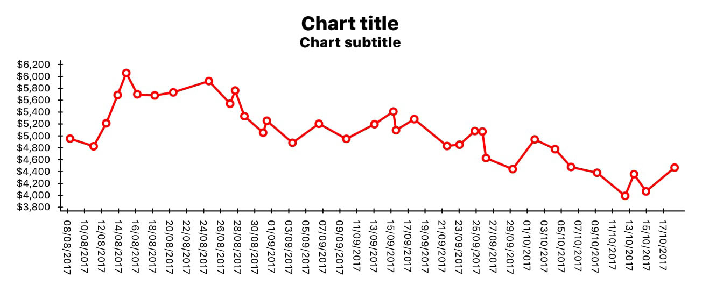
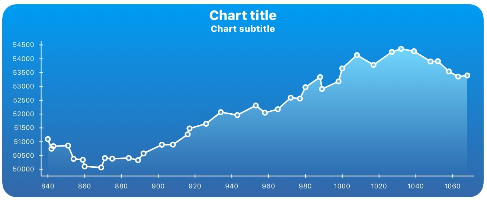
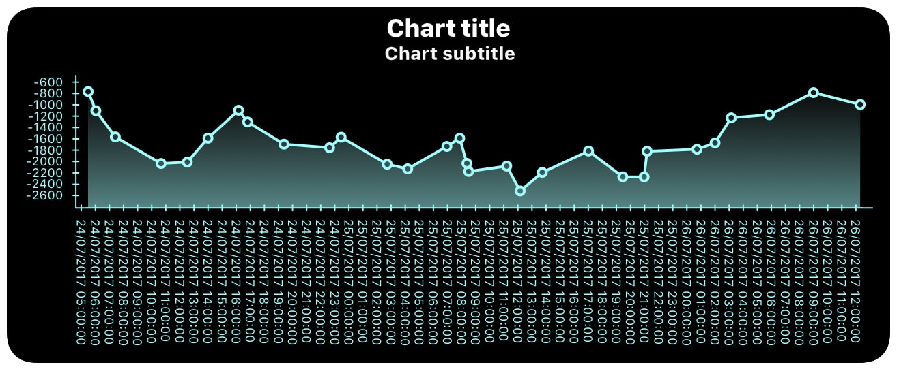
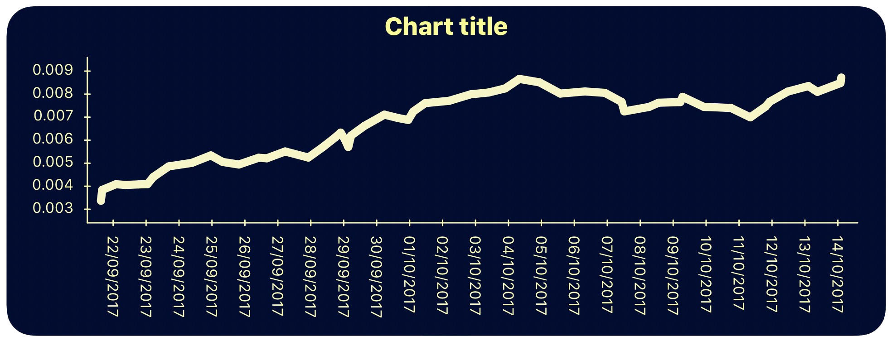
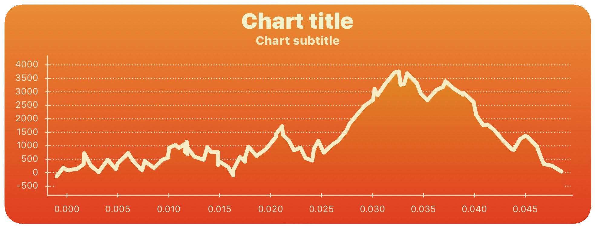
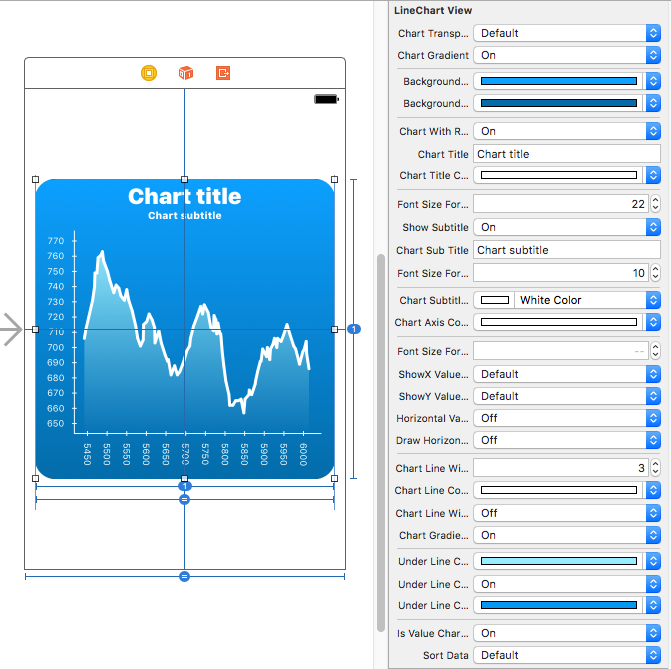

[](http://cocoapods.org/pods/HCLineChartView)
[](http://cocoapods.org/pods/HCLineChartView)
[](http://cocoapods.org/pods/HCLineChartView)


**HCLineChartView** is a beautiful iOS library which makes it super fast and easy to create and customize line charts.

With this library, you can fully customize how your line chart looks. It’s easy to setup and use in any iOS project. It supports chart settings directly from interface builder with live preview. Automatic redrawing on orientation change will make it easy for an application that has portrait and landscape layout.

Take a look at the sample app for examples and usage.

## Examples of usage:

HCLineChartView makes it easy to customize line chart settings and appearance. There are some examples:







## Features:
* Easy to set up
* Easy to customize line chart settings and appearance, i.e. to set up line chart attributes (title, subtitle, colors, gradients, chart line or axis width, font size, ...) directly in interface builder with live preview or from code.
* Easy to set or change chart data and reload the chart
* Automatic detecting if values on the X axis are numerical values or date/time values. Also, it checks if values on the X axis and Y axis are valid.
* Automatic calculating positions and values for ticks for both axes based on chart data and chart frame.
* Automatic redrawing on orientation change events, without distortions.

## Installing

### Podfile

[CocoaPods](https://cocoapods.org/) is a dependency manager for Objective-C and Swift, which automates and simplifies the process of using 3rd-party libraries like HCLineChartView in your projects.<br><br>
To integrate **HCLineChartView** into your Xcode project using CocoaPods, specify it in your Podfile:

```Ruby
target '<TargetName>' do
    use_frameworks!
    pod 'HCLineChartView'
end
```

Then, run the following command:

```
$ pod install
```

### With source code

If you prefer not to use CocoaPods as a dependency manager, you can integrate HCLineChartView into your project manually. Just download repository and include Source/HCLineChartView folder into your project.

## Usage 

1. Add HCLineChartView library to your project via CocoaPods or manually.
    <br>**Note**: HCLineChartView is a library written in Objective-C, but it can also be added to Swift projects using [Bridging Header](https://developer.apple.com/library/content/documentation/Swift/Conceptual/BuildingCocoaApps/MixandMatch.html).
2. Include HCLineChartView library where it is needed. If you have installed this library using Podfile, include it using directive:

    ```objective-c
    #include <HCLineChartView/HCLineChartView.h>
    ```
    If you have manually added this library to your project, include it using:
    ```objective-c
    #import "HCLineChartView.h"
    ```
   
3. Place a UIView into your .storyboard or .xib file and define HCLineChartView as its class:

    
    
    Also, create the outlet for this HCLineChartView in the appropriate file. 

    ```objective-c
    @property (strong, nonatomic) IBOutlet HCLineChartView *hcLineChartView;
    ```
    You can also add this view from code, like any other view:

    ```objective-c
    HCLineChartView* hcLineChartView = [[HCLineChartView alloc] initWithFrame:CGRectMake(100, 100, 300, 300)];
    [self.view addSubview: hcLineChartView];
    ```

5. If you want to change line chart appearance and basic settings, you can setup chart settings in Interface Builder or from code. You don't have to change these parameters. In that case, the chart will be drawn with default settings. If you still want to customize the chart, you can change multiple attributes (title, subtitle, colors, corner radius, ...) directly from the storyboard or xib file. Also, you can change desired properties directly from the code, like in the following example:

   ```objective-c
    self.hcLineChartView.chartTitle = @"Revenue over time";
    self.hcLineChartView.chartTitleColor = [UIColor yellowColor];
    self.hcLineChartView.showSubtitle = NO;
    self.hcLineChartView.chartGradient = YES;
    self.hcLineChartView.backgroundGradientTopColor = [UIColor colorWithRed:0.0 green:0.5 blue:0.5 alpha:1.0];
    self.hcLineChartView.backgroundGradientBottomColor = [UIColor colorWithRed:0.0 green:0.3 blue:0.3 alpha:1.0];
    self.hcLineChartView.chartLineColor = [UIColor yellowColor];
    self.hcLineChartView.chartAxisColor = [UIColor yellowColor];
    self.hcLineChartView.chartGradientUnderline = YES;
    self.hcLineChartView.underLineChartGradientTopColor = [UIColor yellowColor];
    self.hcLineChartView.underLineChartGradientBottomColor = [UIColor orangeColor];
    ```
    You can set all other parameters in the same way.
5. Setup or update chart data:

   ```objective-c
   self.hcLineChartView.xElements = [[NSMutableArray alloc] initWithObjects:@(10),@(20),@(25),@(30),@(40),@(45),@(60),@(65),@(70),@(75),@(80),@(85),@(100),@(120),@(125),@(130),@(145),@(150),@(155),@(165),@(175),@(185),@(195),@(200), nil];
   self.hcLineChartView.yElements = [[NSMutableArray alloc] initWithObjects:@(210),@(222),@(212),@(216),@(232),@(247),@(262),@(261),@(276),@(274),@(281),@(288),@(290),@(283),@(242),@(250),@(270),@(265),@(260),@(262),@(277),@(272),@(281),@(289), nil];
   ```
   If you want to show time on the X axis, you should populate ```xElements``` array with NSDate instances, like in this example:
   ```objective-c
   self.hcLineChartView.xElements = [[NSMutableArray alloc] initWithObjects:
                                        [NSDate dateWithTimeIntervalSince1970:1504785810],
                                        [NSDate dateWithTimeIntervalSince1970:1504795873],
                                        [NSDate dateWithTimeIntervalSince1970:1504805270],
                                        [NSDate dateWithTimeIntervalSince1970:1504815840],
                                        [NSDate dateWithTimeIntervalSince1970:1504825810],
                                        [NSDate dateWithTimeIntervalSince1970:1504835873],
                                        [NSDate dateWithTimeIntervalSince1970:1504845270],
                                        [NSDate dateWithTimeIntervalSince1970:1504855840], NULL];
    ```
   
6. Draw/redraw the chart. <br>After changing the attributes or after updating chart data, you have to redraw the chart:

   ```objective-c
   [self.hcLineChartView drawChart];
   ```
   Also, if you want to update chart data and redraw the chart, you can use updateChartWithData method:
   
   ```objective-c
    NSMutableArray* xElements = [[NSMutableArray alloc] initWithObjects:@(10),@(20),@(25),@(30),@(40),@(45),@(60),@(65),@(70),@(75),@(80),@(85),@(100),@(120),@(125),@(130),@(145),@(150),@(155),@(165),@(175),@(185),@(195),@(200), nil];
    NSMutableArray* yElements = [[NSMutableArray alloc] initWithObjects:@(210),@(222),@(212),@(216),@(232),@(247),@(262),@(261),@(276),@(274),@(281),@(288),@(290),@(283),@(242),@(250),@(270),@(265),@(260),@(262),@(277),@(272),@(281),@(289), nil];
    [self.hcLineChartView updateChartWithXElements:xElements yElements:yElements];
    ```

In any case, you can download and run HCLineChartView Sample project from this repository. In this project, there is an example of usage where you can find out how to use this library.

## Short preview of HCLineChartView basic parameters and methods

For the better understanding how to use those parameters and methods, here is the short overview of basic HCLineChartView attributes and methods which you can use to setup chart. 

### HCLineChartView basic attributes

#### Chart Background Settings
```objective-c
/// This property defines if chart background is transparent or not.
@property IBInspectable BOOL chartTransparentBackground;

/// This property defines if chart background has the gradient.
@property IBInspectable BOOL chartGradient;

/// This property defines the top color for background gradient. It is also the background color for the chart if chartGradient is set to NO.
@property (retain, nonatomic) IBInspectable UIColor* backgroundGradientTopColor;

/// This property defines the bottom color for background gradient.
@property (retain, nonatomic) IBInspectable UIColor* backgroundGradientBottomColor;

/// This property defines if chart view should have rounded corners.
@property IBInspectable BOOL chartWithRoundedCorners;
```

#### Title and Subtitle Settings
```objective-c
@property (retain, nonatomic) IBInspectable NSString* chartTitle;

/// This property defines chart title color.
@property (retain, nonatomic) IBInspectable UIColor* chartTitleColor;

/// This property defines font size for chart title.
@property IBInspectable double fontSizeForTitle;

/// This property defines if the chart has a subtitle.
@property IBInspectable BOOL showSubtitle;

/// This property defines chart subtitle.
@property (retain, nonatomic) IBInspectable NSString* chartSubTitle;

/// This property defines font size for chart subtitle.
@property IBInspectable double fontSizeForSubTitle;

/// This property defines chart subtitle color.
@property (retain, nonatomic) IBInspectable UIColor* chartSubtitleColor;
```

#### Chart Axis Settings

```objective-c
/// This property defines chart axes color.
@property (retain, nonatomic) IBInspectable UIColor* chartAxisColor;

/// This property defines font size for chart axes.
@property IBInspectable double fontSizeForAxis;

/// This property defines if values on the X axis should be in currency format. It is useful in cases where we need to show exchange rate on chart
@property IBInspectable BOOL showXValueAsCurrency;

/// TThis property defines currency code for the X axis. It is relevant if showXValueAsCurrency parameter is set to YES. If you don't define currency code or currency code is not valid, the chart will display your local currency code.
@property (retain, nonatomic) IBInspectable NSString* xAxisCurrencyCode;

/// This property defines if values on the Y axis should be in currency format. It is useful when we need to show exchange rate on the chart (if showXValueAsCurrency is also set to YES), or in any other case where we need to show Y values in currency format (price, saving, debt, surplus, deficit,...)
@property IBInspectable BOOL showYValueAsCurrency;

/// This property defines currency code for the Y axis. It is relevant if showYValueAsCurrency parameter is set to YES. If you don't define currency code or currency code is not valid, the chart will display your local currency code.
@property (retain, nonatomic) IBInspectable NSString* yAxisCurrencyCode;

/// This property defines if values on X axis should be presented horizontally (vertically is default).
@property IBInspectable BOOL horizontalValuesOnXAxis;

/// This property defines if values on this axis should have horizontal orientation (default orientation is vertical)
@property IBInspectable BOOL drawHorizontalLinesForYTicks;
```

#### HCLineChartView Settings
```objective-c
/// This property defines chart line width.
@property IBInspectable float chartLineWidth;

/// This property defines chart line color.
@property (retain, nonatomic) IBInspectable UIColor* chartLineColor;

/// This property defines if chart points should have circles
@property IBInspectable BOOL chartLineWithCircles;

/// This property defines if the area under chart line should have gradient
@property IBInspectable BOOL chartGradientUnderline;

/// This property defines if bottom gradient color for the area under chart line is transparent.
@property (retain, nonatomic) IBInspectable UIColor* underLineChartGradientTopColor;

/// This property defines if bottom gradient color for the area under chart line is transparent.
@property IBInspectable BOOL underLineChartGradientBottomColorIsTransparent;

/// This property defines bottom gradient color for the area under chart line. This parameter is valid only if chart itself isn't transparent
@property (retain, nonatomic) IBInspectable UIColor* underLineChartGradientBottomColor;

/// This property defines if the distribution of values on X axis should be value based.
@property IBInspectable BOOL isValueChartWithRealXAxisDistribution;
```

#### HCLineChartView Data
```objective-c
/// It is recommended to provide already sorted data before drawing the chart. If you don't have values for X axis sorted ascending, you can set this parameter to YES. In that case, provided values for X axis (xElements) will be sorted ascending, with the parallel sorting of paired values for Y axis (yElements). Sorting data could have a small impact on chart drawing performance.
@property IBInspectable BOOL sortData;

/// Array for storing values for the X axis. Only NSNumber and NSDate values are allowed.
@property (retain, nonatomic) NSMutableArray* xElements;

/// Array for storing values for the Y axis. Only NSNumber values are allowed.
@property (retain, nonatomic) NSMutableArray* yElements;
```
By changing these arrays you actually change chart rate data.

### HCLineChartView Methods
#### Drawing and Updating Methods
```objective-c
/// Draws/redraws chart with current data and settings.
-(void)drawChart;

/// Updates chart with new data
/// @param xElements Values for X axis.
/// @param yElements Values for Y axis.
-(void)updateChartWithXElements:(NSArray*)xElements yElements:(NSArray*)yElements;
```

## Notes
* Parameter should have reasonable values. For example. ```chartWithCircles``` parameter should be set to YES only when you have small amount of data. If you have big amount of data, those circles will overlap. Also, ```chartLineWidth``` shouldn't be too big. The same goes for the others.
* It's obvious that some attributes turn off some others. For example, if *showSubtitle* is set to NO the subtitle will be hidden, whatever text you set as a *chartSubTitle*. Also, for example, if you set transparent background, you'll not see background gradient, even if you set it.
* Only NSNumber or NSDate values are allowed for X axis and only NSNumber values for Y axis.
* Provided values for X axis should be in ascending order. If they aren't or you want to be sure that they are sorted ascending, you should set sortData parameter to YES.
* You should set a bigger frame for your HCLineChartView, i.e. big enough to draw chart line, both axes, and other elements. Minimal frame depends on chart settings (font size, chart data, the orientation of values on X axis (horizontal or vertical),...).


If you find any bug, please report it, and we will try to fix it ASAP. Also, any suggestion is welcome.

## Credits

**HCLineChartView** is owned and maintained by the [Hypercube](http://hypercubesoft.com/).
